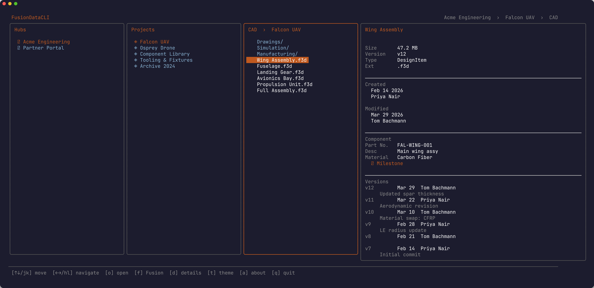

# FusionDataCLI

A terminal browser for [Autodesk Platform Services (APS)](https://aps.autodesk.com) Manufacturing Data Model. Navigate your Fusion hubs, projects, folders, and designs from the command line.



## Install

**Homebrew (macOS / Linux) — recommended**
```sh
brew install schneik80/fusiondatacli/fusiondatacli
```

Or download the latest binary for your platform from [Releases](https://github.com/schneik80/FusionDataCLI/releases).

**macOS (Apple Silicon)**
```sh
VERSION=$(curl -s https://api.github.com/repos/schneik80/FusionDataCLI/releases/latest | grep '"tag_name"' | cut -d'"' -f4 | tr -d v)
curl -L "https://github.com/schneik80/FusionDataCLI/releases/latest/download/FusionDataCLI-${VERSION}-darwin-arm64.tar.gz" | tar xz
sudo mv fusiondatacli /usr/local/bin/
```

**macOS (Intel)**
```sh
VERSION=$(curl -s https://api.github.com/repos/schneik80/FusionDataCLI/releases/latest | grep '"tag_name"' | cut -d'"' -f4 | tr -d v)
curl -L "https://github.com/schneik80/FusionDataCLI/releases/latest/download/FusionDataCLI-${VERSION}-darwin-amd64.tar.gz" | tar xz
sudo mv fusiondatacli /usr/local/bin/
```

**Linux (amd64)**
```sh
VERSION=$(curl -s https://api.github.com/repos/schneik80/FusionDataCLI/releases/latest | grep '"tag_name"' | cut -d'"' -f4 | tr -d v)
curl -L "https://github.com/schneik80/FusionDataCLI/releases/latest/download/FusionDataCLI-${VERSION}-linux-amd64.tar.gz" | tar xz
sudo mv fusiondatacli /usr/local/bin/
```

**Windows** — download `fusiondatacli-{version}-windows-amd64.zip` from the [Releases](https://github.com/schneik80/FusionDataCLI/releases) page and add the binary to your `PATH`.

## Usage

```sh
fusiondatacli
```

On first run the app opens your browser for Autodesk sign-in. After authenticating, navigate with keyboard or mouse:

| Key | Action |
|-----|--------|
| `↑` `↓` / `j` `k` | Move cursor |
| `→` `↵` / `l` | Enter folder / open details |
| `←` / `h` | Go back |
| `o` | Open in browser |
| `f` | Open in Fusion desktop |
| `d` | Toggle details panel |
| `t` | Cycle color theme |
| `m` | Toggle mouse support on/off |
| `a` | About / license |
| `r` | Refresh |
| `?` | Debug log |
| `q` | Quit |

### Mouse support

Mouse support is enabled by default. Click items to select and navigate, use the scroll wheel to move through lists. Press `m` to toggle mouse on/off. The footer bar shows the current mouse state.

### Breadcrumb bar

The header displays a breadcrumb trail showing your current location in the hierarchy: Hub > Project > Folder(s) > Document.

### Non-US hubs

If your Fusion hub is in EMEA or Australia, set the region before running:

```sh
APS_REGION=EMEA fusiondatacli   # Europe, Middle East, Africa
APS_REGION=AUS  fusiondatacli   # Australia
```

## Details panel

Press `→` on any design to open the details panel. It shows:

- File size and current version number
- Created and last modified date and user
- Component metadata: part number, description, material, milestone flag
- Full version history with save comments

## Requirements

- An [Autodesk account](https://accounts.autodesk.com) with access to at least one Fusion Team hub
- macOS 12+, Linux, or Windows 10+
- Port `7879` available locally during sign-in (used for the OAuth callback)

## Building from source

Requires Go 1.22+.

```sh
git clone https://github.com/schneik80/FusionDataCLI
cd FusionDataCLI
```

**With your own APS app** (register a public client at [aps.autodesk.com/myapps](https://aps.autodesk.com/myapps), redirect URI `http://localhost:7879/callback`, scope `data:read`):

```sh
make build CLIENT_ID=your-client-id
```

Or store your client ID in a git-ignored file:

```sh
echo "your-client-id" > .aps-client-id
make build
```

**Local dev without an embedded client ID** (supply via env var at runtime):

```sh
make dev
APS_CLIENT_ID=your-client-id ./fusiondatacli
```

## License

[MIT](LICENSE) — © Kevin Schneider
