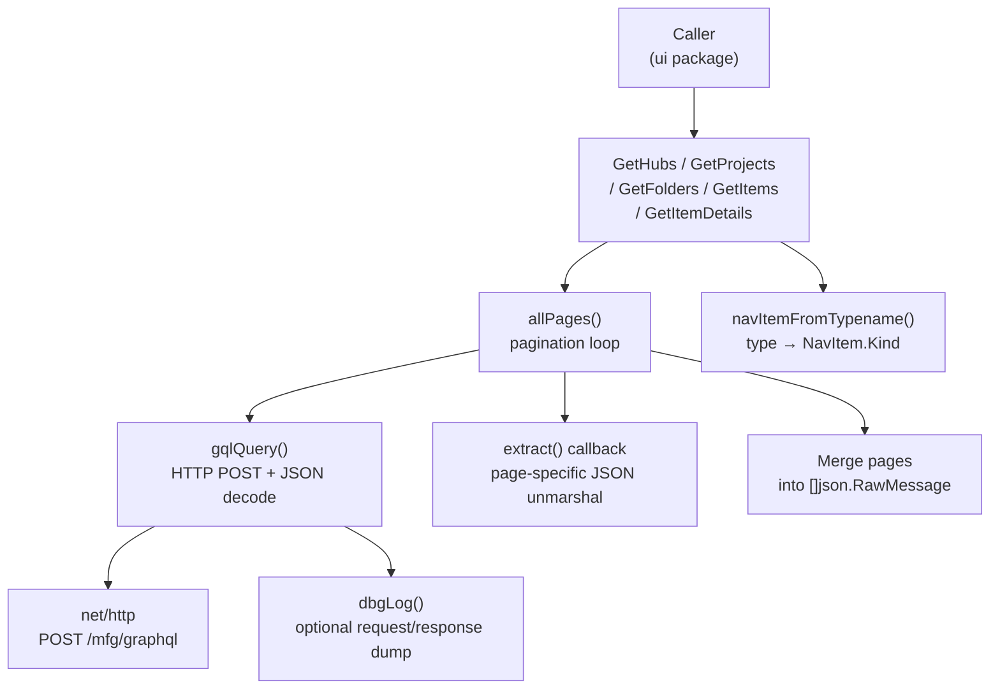
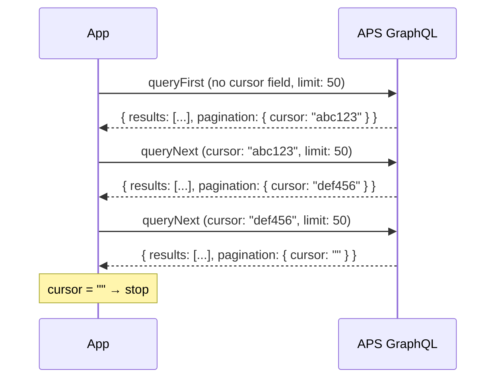

# APS Manufacturing Data Model API

FusionDataCLI queries the **APS Manufacturing Data Model GraphQL API v2** to retrieve hub, project, folder, and item data. All requests are authenticated with a Bearer token obtained through the OAuth PKCE flow.

---

## GraphQL Endpoint

```
POST https://developer.api.autodesk.com/mfg/graphql
Content-Type: application/json
Authorization: Bearer <access_token>
X-Ads-Region: <region>          (optional — US default, EMEA, or AUS)
```

The `X-Ads-Region` header is only sent when a non-default region is configured. It is omitted entirely for US hubs.

---

## API Client Design



---

## Pagination Strategy

The APS GraphQL API uses **cursor-based pagination**. A page returns a cursor string; passing that cursor in the next request fetches the following page. An empty cursor means the last page has been reached.

**Critical implementation detail:** The API rejects a first-page request that includes a `cursor` variable set to `null` or `""`. Two separate query strings are used per endpoint — one without a cursor parameter, one with `$cursor: String!`.



Pagination limit is set to `50` per page. The APS API accepts values from 1–99 (the documented max of 100 is exclusive).

---

## Queries

### GetHubs

Fetches all hubs the authenticated user has access to.

```graphql
# First page
query GetHubs {
    hubs(pagination: { limit: 50 }) {
        pagination { cursor }
        results {
            id
            name
            fusionWebUrl
            alternativeIdentifiers {
                dataManagementAPIHubId
            }
        }
    }
}

# Subsequent pages
query GetHubsNext($cursor: String!) {
    hubs(pagination: { cursor: $cursor, limit: 50 }) {
        pagination { cursor }
        results {
            id
            name
            fusionWebUrl
            alternativeIdentifiers {
                dataManagementAPIHubId
            }
        }
    }
}
```

**Output fields used:**

| Field | Maps to |
|-------|---------|
| `id` | `NavItem.ID` |
| `name` | `NavItem.Name` |
| `fusionWebUrl` | `NavItem.WebURL` |
| `alternativeIdentifiers.dataManagementAPIHubId` | `NavItem.AltID` (used to build browser URLs) |

---

### GetProjects

Fetches projects within a hub. Uses the `hub(hubId)` nested resolver. Inactive projects are filtered client-side.

```graphql
# First page
query GetProjects($hubId: ID!) {
    hub(hubId: $hubId) {
        projects(pagination: { limit: 50 }) {
            pagination { cursor }
            results {
                id
                name
                fusionWebUrl
                projectStatus
                projectType
                alternativeIdentifiers {
                    dataManagementAPIProjectId
                }
            }
        }
    }
}

# Subsequent pages
query GetProjectsNext($hubId: ID!, $cursor: String!) {
    hub(hubId: $hubId) {
        projects(pagination: { cursor: $cursor, limit: 50 }) {
            pagination { cursor }
            results { ... }
        }
    }
}
```

**Filtering:** Projects where `projectStatus` is `"inactive"` (case-insensitive) are excluded from results.

---

### GetFolders

Fetches top-level folders for a project.

```graphql
# First page
query GetFolders($projectId: ID!) {
    foldersByProject(projectId: $projectId, pagination: { limit: 50 }) {
        pagination { cursor }
        results {
            id
            name
        }
    }
}
```

Folders have no `fusionWebUrl` — their URL is constructed from project context when needed.

---

### GetProjectItems

Fetches items (designs, drawings) directly under a project root (not inside a folder).

```graphql
# First page
query GetProjectItems($projectId: ID!) {
    itemsByProject(projectId: $projectId, pagination: { limit: 50 }) {
        pagination { cursor }
        results {
            __typename
            id
            name
        }
    }
}
```

---

### GetItems

Fetches items within a specific folder.

```graphql
# First page
query GetItems($hubId: ID!, $folderId: ID!) {
    itemsByFolder(hubId: $hubId, folderId: $folderId, pagination: { limit: 50 }) {
        pagination { cursor }
        results {
            __typename
            id
            name
        }
    }
}
```

---

### GetItemDetails

Fetches rich metadata for a single item plus its complete version history. This query is not paginated.

```graphql
query GetItemDetails($hubId: ID!, $itemId: ID!) {
    item(hubId: $hubId, itemId: $itemId) {
        __typename
        id
        name
        size
        mimeType
        extensionType
        createdOn
        createdBy  { firstName lastName }
        lastModifiedOn
        lastModifiedBy { firstName lastName }

        ... on DesignItem {
            fusionWebUrl
            tipVersion { versionNumber }
            tipRootComponentVersion {
                partNumber
                partDescription
                materialName
                isMilestone
            }
        }
        ... on DrawingItem {
            fusionWebUrl
            tipVersion { versionNumber }
        }
        ... on ConfiguredDesignItem {
            fusionWebUrl
            tipVersion { versionNumber }
        }
    }

    itemVersions(hubId: $hubId, itemId: $itemId) {
        results {
            versionNumber
            name
            createdOn
            createdBy { firstName lastName }
        }
    }
}
```

`itemVersions.results` are returned oldest-first by the API. The UI reverses the slice to display newest-first.

---

## NavItem Struct

All list queries produce `[]NavItem`. This is the fundamental navigation unit passed between the `api` and `ui` packages.

```go
type NavItem struct {
    ID          string  // GraphQL node ID
    Name        string
    Kind        string  // see table below
    AltID       string  // dataManagementAPIHubId or dataManagementAPIProjectId
    WebURL      string  // fusionWebUrl if available
    IsContainer bool    // true for hub, project, folder
}
```

**Kind mapping from `__typename`:**

| GraphQL `__typename` | `Kind` | `IsContainer` |
|---|---|---|
| (hub — set explicitly) | `"hub"` | `true` |
| (project — set explicitly) | `"project"` | `true` |
| (folder — set explicitly) | `"folder"` | `true` |
| `DesignItem` | `"design"` | `false` |
| `DrawingItem` | `"drawing"` | `false` |
| `ConfiguredDesignItem` | `"configured"` | `false` |
| anything else | `"unknown"` | `false` |

---

## ItemDetails Struct

Returned by `GetItemDetails`. Contains everything needed for the details panel.

```go
type ItemDetails struct {
    ID            string
    Name          string
    Typename      string        // DesignItem | DrawingItem | ConfiguredDesignItem | BasicItem
    Size          string        // raw bytes as string from API
    MimeType      string
    ExtensionType string
    FusionWebURL  string
    CreatedOn     time.Time
    CreatedBy     string        // "First Last"
    ModifiedOn    time.Time
    ModifiedBy    string
    VersionNumber int           // tipVersion.versionNumber
    // Design-specific
    PartNumber  string
    PartDesc    string
    Material    string
    IsMilestone bool
    // Versions — most recent first
    Versions []VersionSummary
}

type VersionSummary struct {
    Number    int
    CreatedOn time.Time
    CreatedBy string
    Comment   string           // version save comment (may be empty)
}
```

---

## Timestamp Parsing

The API returns timestamps in ISO-8601 format. Two formats are handled:

```go
// Primary: RFC 3339
time.Parse(time.RFC3339, s)           // "2026-03-15T14:30:00Z"

// Fallback: millisecond variant
time.Parse("2006-01-02T15:04:05.000Z", s)   // "2026-03-15T14:30:00.000Z"
```

---

## Error Handling

GraphQL errors are returned in a top-level `errors` array alongside `data`. The client collects all error messages and joins them with `"; "`:

```json
{
  "errors": [
    { "message": "internal server error" }
  ]
}
```

HTTP-level errors (non-2xx) are returned directly:
- `401 Unauthorized` → surfaced as "unauthorized — token may be expired (re-run to reauthenticate)"
- Other 4xx/5xx → raw status string

---

## Debug Mode

Set `APSNAV_DEBUG=1` before running to enable full request/response logging:

```sh
APSNAV_DEBUG=1 fusiondatacli
```

Logs are stored in memory (rolling buffer, max 500 lines) and displayed via the `?` overlay in the browser. Each entry includes:
- Query name and variables
- HTTP status code
- Raw JSON response body

Debug logs are **not** written to disk and do not include Authorization header values.

---

## Region Support

APS hubs in EMEA and Australia are served from regional API endpoints. Set the region before running:

```sh
APS_REGION=EMEA fusiondatacli   # Europe, Middle East, Africa
APS_REGION=AUS  fusiondatacli   # Australia
```

Or set `"region": "EMEA"` in `~/.config/fusiondatacli/config.json`.

When a region is set, the `X-Ads-Region` header is added to every GraphQL request.
