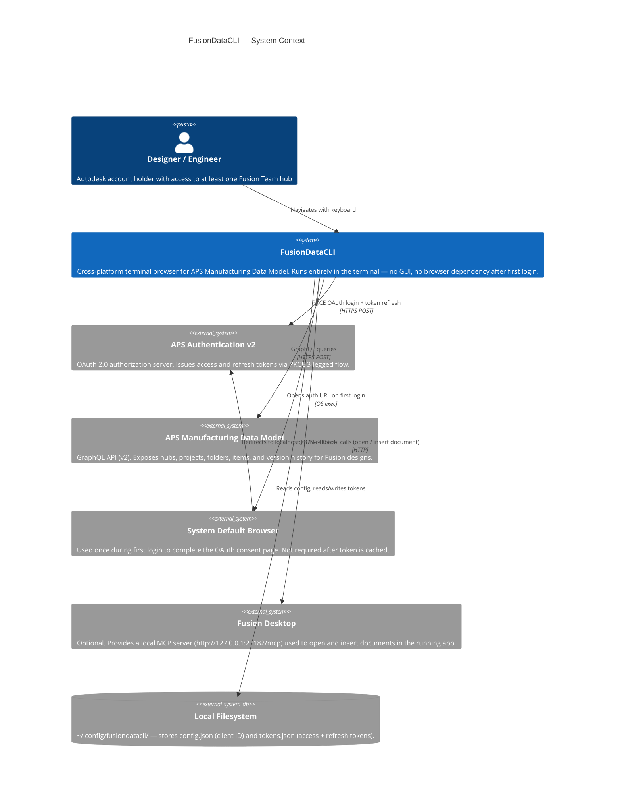
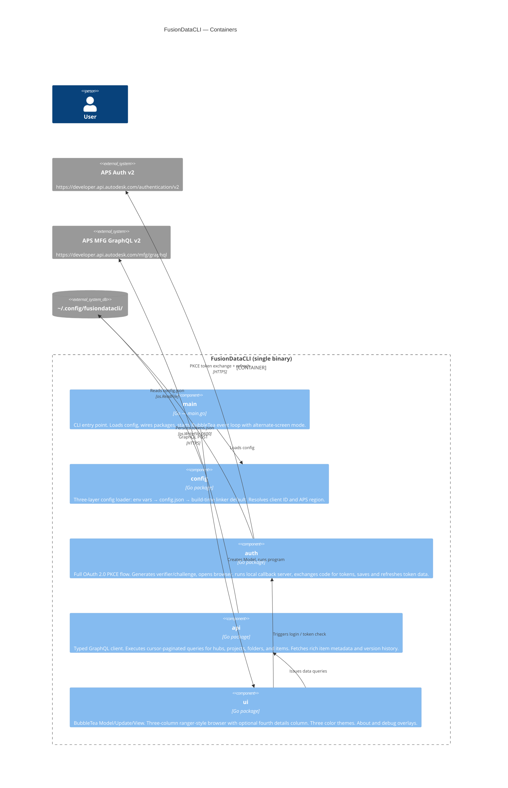
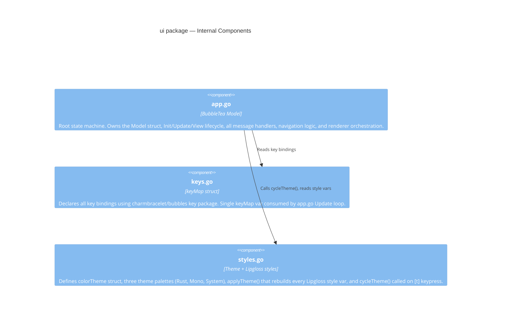
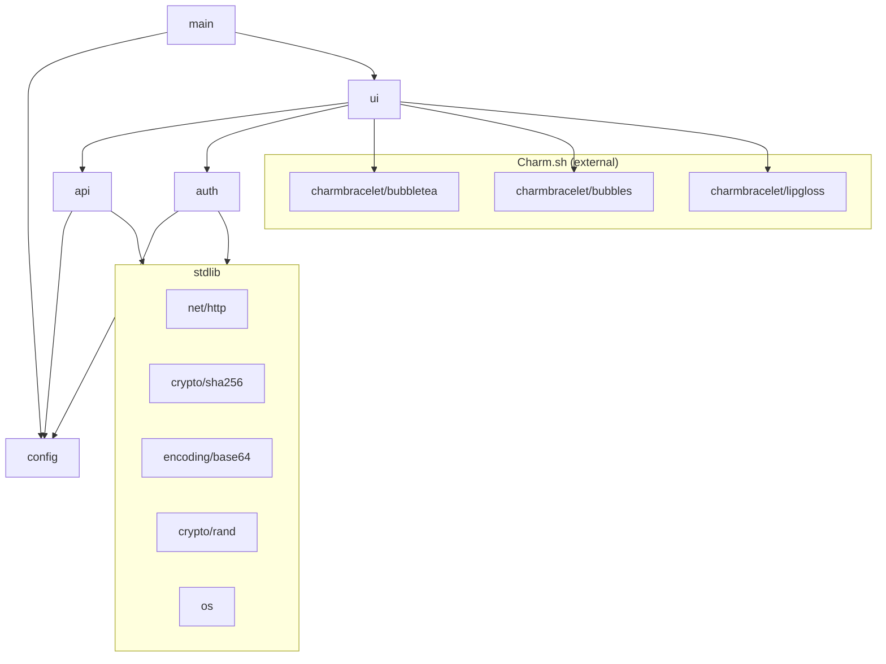
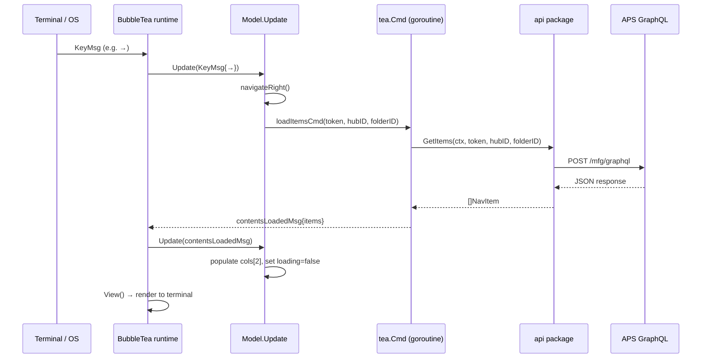

# Architecture

FusionDataCLI is a single-binary terminal application written in Go. It authenticates with Autodesk Platform Services (APS), then renders a live three-column browser over the Manufacturing Data Model hierarchy using a reactive TUI loop.

---

## System Context



---

## Container Diagram



---

## Component Diagram — `ui` package



---

## Package Dependency Graph



---

## Data Flow — From Keypress to Screen



---

## File Layout

```
FusionDataCLI/
├── main.go                  Entry point; wires config → ui; sets version ldflag
│
├── config/
│   └── config.go            Config struct, Load(), Dir(), Path(), DefaultClientID
│
├── auth/
│   ├── oauth.go             Login(), Refresh(), OpenBrowser(), PKCE helpers
│   ├── callback.go          WaitForCallback() — local HTTP server on :7879
│   └── tokens.go            LoadTokens(), SaveTokens(), TokenData.Valid()
│
├── api/
│   ├── client.go            gqlQuery(), NavItem struct, SetRegion(), EnableDebug()
│   ├── queries.go           GetHubs/Projects/Folders/Items; allPages() pagination
│   ├── details.go           GetItemDetails(), ItemDetails, VersionSummary, parseTime()
│   └── debug.go             dbgLog(), DebugLines(), DebugEnabled()
│
├── ui/
│   ├── app.go               Model, Init, Update, View; all state/nav/render logic
│   ├── keys.go              keyMap, keys var
│   └── styles.go            colorTheme, themes[], applyTheme(), cycleTheme()
│
├── docs/                    This documentation
├── .goreleaser.yaml         Build + release pipeline (goreleaser v2)
└── .github/workflows/
    └── release.yml          GitHub Actions: goreleaser + Homebrew tap on tag push
```
