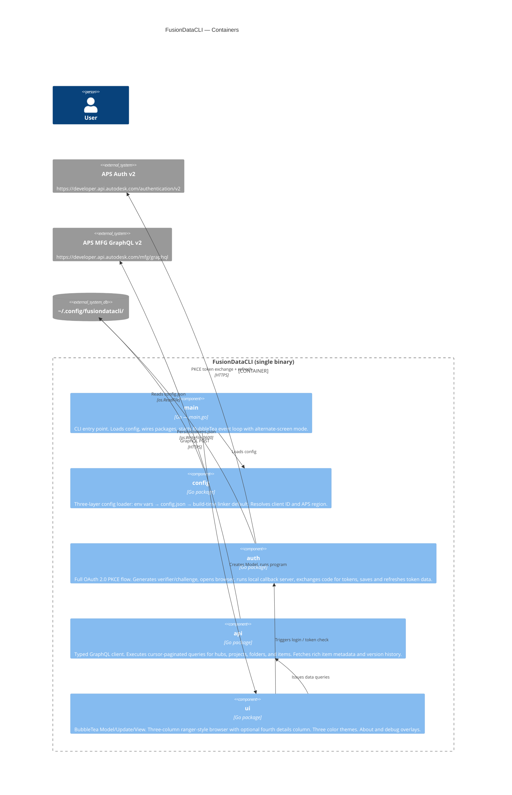
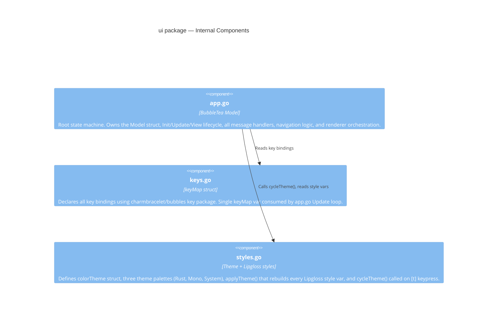
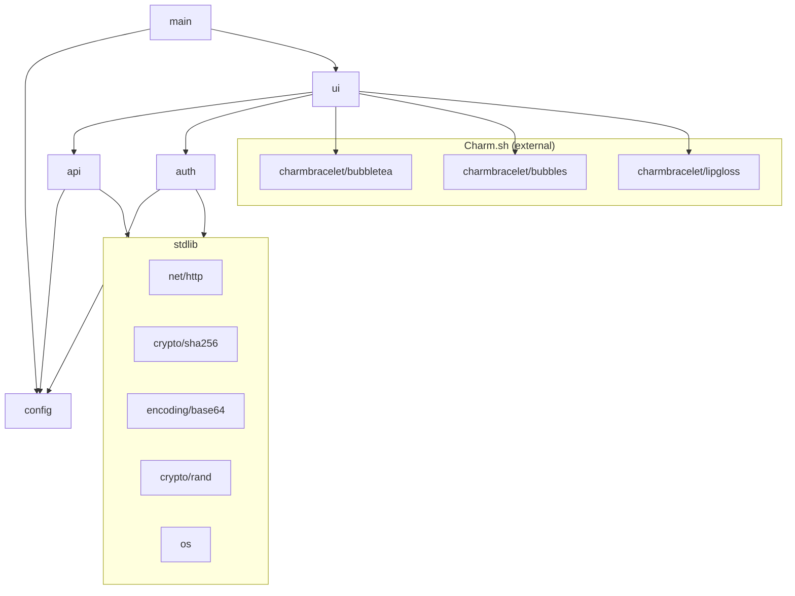
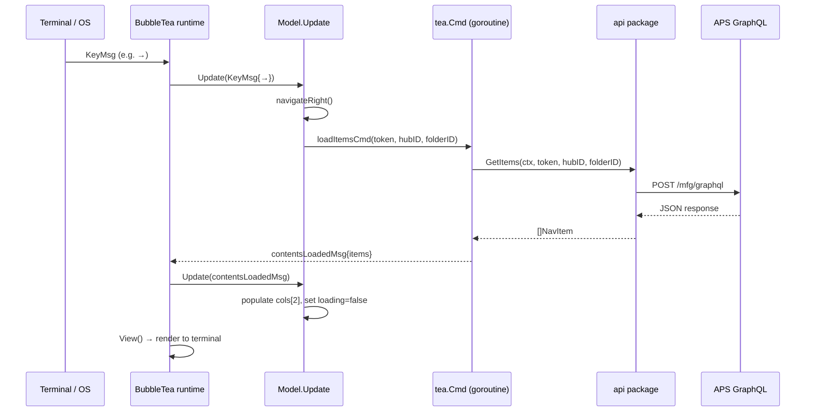

# Architecture

FusionDataCLI is a single-binary terminal application written in Go. It authenticates with Autodesk Platform Services (APS), then renders a live three-column browser over the Manufacturing Data Model hierarchy using a reactive TUI loop.

---

## System Context


---

## Container Diagram



---

## Component Diagram — `ui` package



---

## Package Dependency Graph



---

## Data Flow — From Keypress to Screen



---

## Performance Optimisations

The browser View() runs at spinner rate (~10 Hz) and re-renders every visible row each frame, so a few targeted caches keep navigation snappy on large hubs:

- **`detailsCache map[string]*api.ItemDetails`** — `GetItemDetails` results are memoised by item ID for the lifetime of the session. Item details are immutable for a given ID (a save creates a new version with a new tip-version number, but the item ID is stable), so arrowing back over a previously-visited item is served synchronously without an API call. Refresh (`r`) and hub re-selection clear the map to force re-fetch.
- **`styleCache`** — Lipgloss styles are value types but their rules clone on each chained `.Width(...).Foreground(...)` call. The width-applied variants used in `renderColumn` / `viewDetailsColumn` are precomputed and rebuilt only when terminal size or theme changes. The cache is shared by pointer because Bubble Tea passes the Model by value to View(); a local mutation on a copy would not persist. The rendered detail-panel lines are also cached and keyed on `m.details`'s pointer + width + theme version.
- **Parallel project-contents fetch** — `loadProjectContentsCmd` issues `foldersByProject` and `itemsByProject` concurrently via `sync.WaitGroup` rather than sequentially. Wall-clock latency drops to roughly the slower of the two queries.

---

## Test Strategy

Tests live alongside the code they exercise (`*_test.go`) in three layers:

| Layer | What it covers | How |
|-------|----------------|-----|
| **L1 — Pure unit** | Config parsing, OAuth helpers (PKCE verifier/challenge, URL builder), GraphQL response decoding, MCP envelope helpers, UI helpers (filename sanitisation, breadcrumb building, layout math) | Plain `testing.T`, table-driven, no I/O |
| **L2 — HTTP integration** | Full OAuth flow against a fake auth server, `gqlQuery` against fake GraphQL, MCP JSON-RPC session caching + retry against fake MCP, H1 + H2 regression guards | `httptest.Server` driven via `internal/testutil` |
| **L3 — TUI flow** | Bubble Tea `Update(msg)` / `View()` drive end-to-end through `tea.Cmd` → `api` → mocked APS server | Direct `Update`/`View` calls; `api.SetGraphqlEndpointForTesting` swaps the endpoint |

Final coverage on Phase 3 (PR #4):

| Package | Coverage |
|---------|----------|
| `config` | 90.6% |
| `fusion` | 84.2% |
| `auth` | 73.9% |
| `api` | 69.7% |
| `ui` | 32.5% |
| **Total** | **43.1%** |

The full `go test -race ./...` suite finishes in under five seconds. CI (`.github/workflows/test.yml`) runs `go vet` + `go test -race -count=1 -coverprofile` on every pull request and push to `main`; locally `make check` does the same.

### `internal/testutil/`

A single shared package houses the in-process HTTP fakes. Two helpers, both auto-cleaned via `t.Cleanup`:

- `GraphQLServer(t, handler)` — emulates `https://developer.api.autodesk.com/mfg/graphql`. Decodes the POST body to `{Query, Variables}`, captures the `Authorization` and `X-Ads-Region` headers, and lets the handler return `{Data, Errors, Status, RawBody}`. Used by `auth/`, `api/`, and `ui/` tests.
- `NewMCPServer(t, scenario)` — emulates the Fusion desktop MCP JSON-RPC server. Handles `initialize`, the `notifications/initialized` notification (HTTP 204), and `tools/call` dispatched via `scenario.Tools`. Tracks per-tool call counts, init counts, and session-ID arrival order so tests can assert on retry / session-cache behaviour.

### Const→var pattern for testability

Several production endpoints and clock dependencies are declared as package-level `var` (rather than `const`) specifically so tests can swap them. Production code never reassigns them.

| Symbol | Package | Purpose |
|--------|---------|---------|
| `graphqlEndpoint` | `api/client.go` | APS GraphQL URL — also exposed via `SetGraphqlEndpointForTesting` for cross-package tests |
| `authEndpoint`, `tokenEndpoint`, `authScope` | `auth/oauth.go` | OAuth endpoints + scope |
| `callbackPort`, `CallbackURL` | `auth/callback.go` | Loopback listener port (set to `:0` for ephemeral binding in tests) |
| `userHomeDir`, `nowFunc` | `api/download.go` | Stubbed to a `t.TempDir()` and a fixed clock for deterministic STEP-path output |

This is the convention to follow when adding a new external dependency that needs to be mockable.

---

## File Layout

```
FusionDataCLI/
├── main.go                  Entry point; wires config → ui; sets version ldflag
│
├── config/
│   └── config.go            Config struct, Load(), Dir(), Path(), DefaultClientID
│
├── auth/
│   ├── oauth.go             Login(), Refresh(), OpenBrowser(), PKCE helpers
│   ├── callback.go          WaitForCallback() — local HTTP server bound to 127.0.0.1:7879
│   └── tokens.go            LoadTokens(), SaveTokens(), TokenData.Valid()
│
├── api/
│   ├── client.go            gqlQuery(), NavItem, SetRegion(), SetGraphqlEndpointForTesting()
│   ├── queries.go           GetHubs/Projects/Folders/Items; allPages() pagination
│   ├── details.go           GetItemDetails(), ItemDetails, VersionSummary, parseTime()
│   ├── download.go          RequestSTEPDerivative(), DownloadFile(), StepDownloadPath()
│   └── debug.go             dbgLog(), DebugLines(), DebugEnabled()
│
├── fusion/
│   └── mcp.go               Fusion desktop MCP client (open / insert document)
│
├── ui/
│   ├── app.go               Model, Init, Update, View; all state/nav/render logic
│   ├── keys.go              keyMap, keys var
│   └── styles.go            colorTheme, themes[], applyTheme(), cycleTheme()
│
├── internal/testutil/       Shared test fakes — GraphQLServer, NewMCPServer
│   ├── graphql.go           In-process APS GraphQL fake (httptest.Server)
│   └── mcp.go               In-process Fusion MCP JSON-RPC fake
│
├── docs/                    This documentation
├── SECURITY-TODO.md         Pending security follow-ups (M1, M3, L1–L5)
├── .goreleaser.yaml         Build + release pipeline (goreleaser v2)
└── .github/workflows/
    ├── release.yml          GoReleaser + signed/notarized macOS .pkg on tag push
    └── test.yml             go vet + go test -race on every PR and push to main
```
