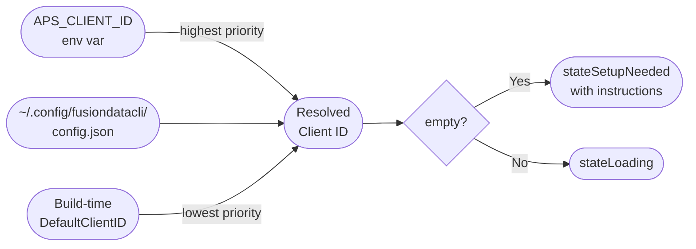
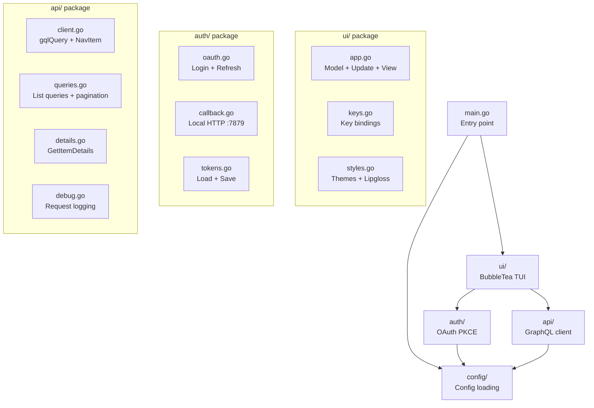

# Development

Everything needed to build, run, test, and release FusionDataCLI from source.

---

## Requirements

| Tool | Version | Purpose |
|------|---------|---------|
| Go | 1.22+ | Build and run |
| goreleaser | v2 | Cross-platform release builds |
| git | any | Version tags trigger releases |
| An APS app registration | — | Client ID for OAuth |

---

## APS App Registration

Register a **public client** app at [aps.autodesk.com/myapps](https://aps.autodesk.com/myapps):

- **App type:** Desktop / Native
- **Callback URL:** `http://localhost:7879/callback`
- **Scopes:** `data:read`, `user-profile:read`

Copy the **Client ID**. No client secret is needed for public clients.

---

## Configuration

### Environment variables (recommended for development)

```sh
export APS_CLIENT_ID=your-client-id
export APS_REGION=EMEA          # optional — US default
```

### Config file (persistent)

```sh
mkdir -p ~/.config/fusiondatacli
cat > ~/.config/fusiondatacli/config.json <<EOF
{
  "client_id": "your-client-id",
  "region": "US"
}
EOF
```

### Build-time default (for distributable binaries)

The published binaries embed a default client ID via linker flags:

```sh
go build -ldflags "-X github.com/schneik80/FusionDataCLI/config.DefaultClientID=<id>" .
```

Users of the published binary need no configuration — the embedded client ID is used automatically.

### Config resolution order



---

## Building

```sh
# Clone
git clone https://github.com/schneik80/FusionDataCLI
cd FusionDataCLI

# Dev run (no embedded client ID — supply via env var)
APS_CLIENT_ID=your-id go run .

# Build binary with embedded client ID
go build -ldflags \
  "-X main.version=dev \
   -X github.com/schneik80/FusionDataCLI/config.DefaultClientID=your-id" \
  -o fusiondatacli .

# Or use the Makefile
make build CLIENT_ID=your-id
make dev                          # go run . without embedded ID
```

---

## Project Structure



---

## Debug Mode

```sh
APSNAV_DEBUG=1 fusiondatacli
```

- Logs every GraphQL request body and response
- Press `?` in the browser to view the rolling log (max 500 lines)
- Nothing is written to disk; logs live only in memory for the session

---

## Dependencies

All external dependencies are from the [Charm.sh](https://charm.sh) ecosystem. No other third-party libraries are used — auth and HTTP are handled with the Go standard library.

| Module | Version | Purpose |
|--------|---------|---------|
| `github.com/charmbracelet/bubbletea` | v1 | TUI event loop (Model/Update/View) |
| `github.com/charmbracelet/bubbles` | v1 | Spinner component |
| `github.com/charmbracelet/lipgloss` | v1 | Terminal styling and layout |

```sh
go mod tidy     # sync go.mod + go.sum
go mod download # pre-fetch dependencies
```

---

## Release Pipeline

```mermaid
flowchart TD
    Dev([Developer]) -- "git tag v0.x.y\ngit push origin v0.x.y" --> GH[GitHub]
    GH -- "tag push event" --> Actions[GitHub Actions\nrelease.yml]

    subgraph "release job"
        Actions --> Checkout[actions/checkout]
        Checkout --> SetupGo[actions/setup-go]
        SetupGo --> GoReleaser[goreleaser/goreleaser-action v6]
        GoReleaser --> Builds["Build 5 binaries\ndarwin/amd64\ndarwin/arm64\nlinux/amd64\nlinux/arm64\nwindows/amd64"]
        Builds --> Archives["Create archives\nFusionDataCLI-{ver}-{os}-{arch}.tar.gz\nFusionDataCLI-{ver}-windows-amd64.zip"]
        Archives --> Checksums[checksums.txt]
        Archives --> GHRelease[GitHub Release\nv{version}]
        GHRelease --> BrewFormula["Push formula to\nschneik80/homebrew-fusiondatacli\nFormula/fusiondatacli.rb"]
    end
```

### Triggering a release

```sh
git tag v0.4.0
git push origin v0.4.0
```

The workflow fires automatically. No manual steps needed.

### Required GitHub secrets

| Secret | Purpose |
|--------|---------|
| `GITHUB_TOKEN` | Auto-provided by Actions — creates the release |
| `APS_CLIENT_ID` | Embedded into binaries at build time via ldflag |
| `HOMEBREW_TAP_GITHUB_TOKEN` | PAT with `repo` scope on `homebrew-fusiondatacli` tap |

### Goreleaser config highlights (`.goreleaser.yaml`)

| Setting | Value | Why |
|---------|-------|-----|
| `project_name` | `FusionDataCLI` | Sets archive filename casing — must match homebrew formula URL expectations |
| `binary` | `fusiondatacli` | Lowercase binary name installed into `$PATH` |
| `ldflags` | `-s -w -X main.version -X config.DefaultClientID` | Strip debug info, embed version + client ID |
| `CGO_ENABLED=0` | yes | Pure Go, no C dependencies — enables full cross-compilation |
| `ignore` | `windows/arm64` | Not yet supported |
| `brews.directory` | `Formula` | Formula output directory in the tap repo |

---

## Homebrew Tap

The tap repo is [github.com/schneik80/homebrew-fusiondatacli](https://github.com/schneik80/homebrew-fusiondatacli).

goreleaser generates `Formula/fusiondatacli.rb` after each release with:
- Explicit `version "x.y.z"` field (prevents Homebrew from misdetecting the version from the archive filename)
- Per-platform binary URLs with SHA-256 checksums
- `bin.install "fusiondatacli"` install block

```sh
# Install
brew install schneik80/fusiondatacli/fusiondatacli

# Upgrade
brew update && brew upgrade fusiondatacli

# Verify
brew info fusiondatacli
```

---

## Version String

The binary version is set at build time:

```sh
# In goreleaser
-X main.version={{ .Version }}

# In dev builds
-X main.version=dev

# Access in code
var version = "dev"   // overwritten by ldflag
```

The version is displayed in the About screen (`a` key) and passed into the UI model at startup.

---

## Changelog

goreleaser generates the changelog from git commit messages. Commits are filtered:

| Prefix | Included in changelog? |
|--------|----------------------|
| `feat:` | ✓ |
| `fix:` | ✓ |
| `refactor:` | ✓ |
| `docs:` | ✗ |
| `test:` | ✗ |
| `chore:` | ✗ |
| Merge commits | ✗ |

Use [Conventional Commits](https://www.conventionalcommits.org/) style for clean release notes.
