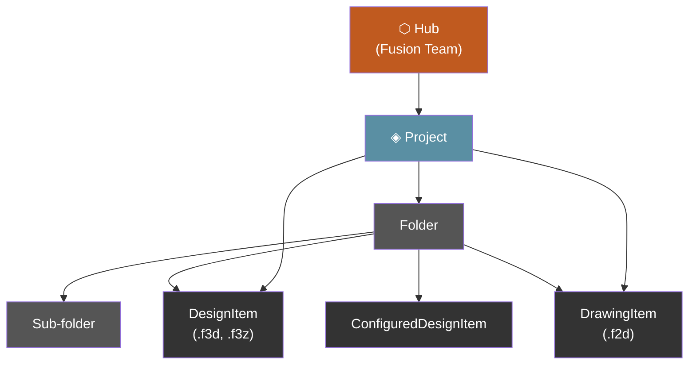
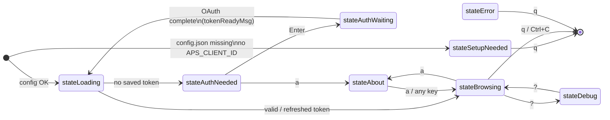
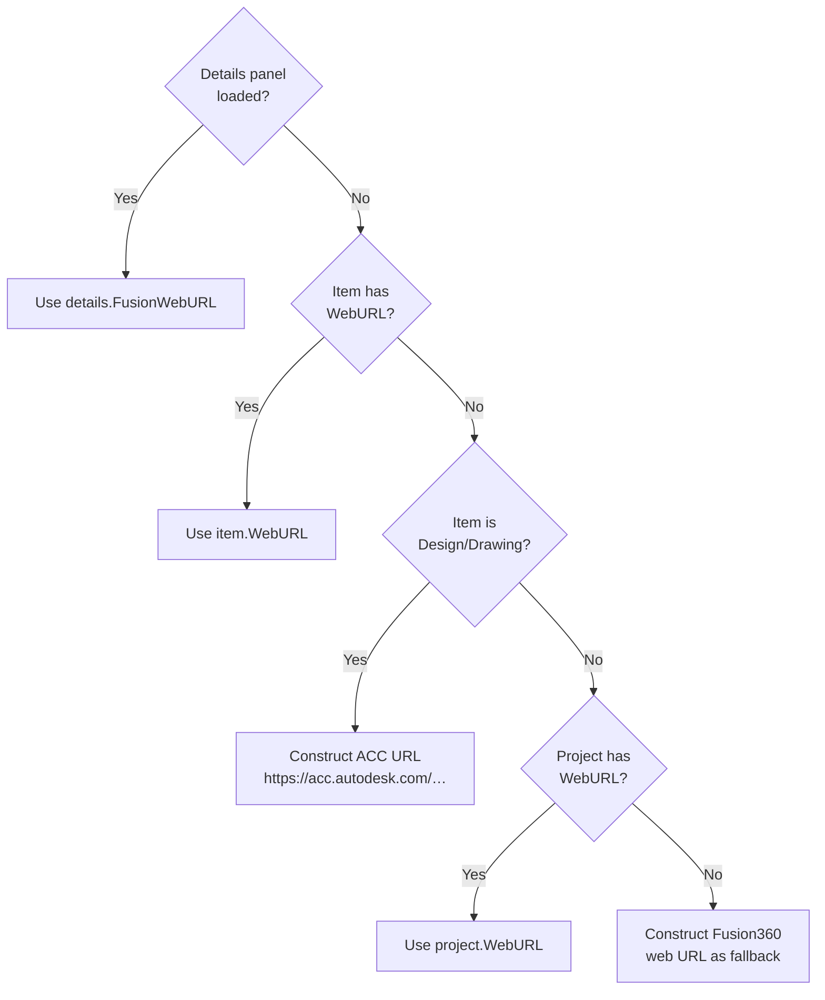

# Navigation & User Interface

FusionDataCLI presents the APS Manufacturing Data Model as a three-column ranger-style browser directly in your terminal. Each column represents one level of the hierarchy. Drilling right loads the next level; pressing left goes back.

---

## Data Hierarchy

The APS Manufacturing Data Model is a tree. FusionDataCLI maps each level to a column in the browser.



**Item types returned by the API:**

| `__typename` | Kind | Container | Description |
|---|---|---|---|
| (hub) | `hub` | ✓ | Top-level Fusion Team |
| (project) | `project` | ✓ | ACC / Fusion project |
| (folder) | `folder` | ✓ | Directory in project |
| `DesignItem` | `design` | — | Parametric design (.f3d) |
| `DrawingItem` | `drawing` | — | 2D drawing (.f2d) |
| `ConfiguredDesignItem` | `configured` | — | Configured design variant |
| other | `unknown` | — | Unsupported type |

---

## Application State Machine



### State descriptions

| State | Description |
|-------|-------------|
| `stateSetupNeeded` | No client ID found in env, config file, or build default. Displays setup instructions. |
| `stateLoading` | Checking saved tokens, refreshing if expired, loading initial hubs list. Spinner shown. |
| `stateAuthNeeded` | No valid token. Prompts user to press Enter to open browser login. |
| `stateAuthWaiting` | Browser opened, local callback server running, waiting for OAuth redirect. |
| `stateBrowsing` | Normal three-column (or four-column with details) interactive browser. |
| `stateAbout` | Scrollable overlay showing version, copyright, MIT license, and third-party credits. |
| `stateDebug` | Scrollable overlay showing raw API request/response log (requires `APSNAV_DEBUG=1`). |
| `stateError` | Fatal error with full message. Quit only. |

---

## Key Bindings

### Navigation

| Key | Action |
|-----|--------|
| `↑` `k` | Move cursor up in active column |
| `↓` `j` | Move cursor down in active column |
| `→` `l` `Enter` | Move focus right — load next level or open details |
| `←` `h` | Move focus left — go back or pop folder from stack |

### Actions

| Key | Action |
|-----|--------|
| `d` | Toggle details panel (fourth column) |
| `o` | Open focused item in system default browser (requires an autodesk.com browser session — press `s` first if needed) |
| `s` | Open `accounts.autodesk.com/logon` in the default browser to establish a web session |
| `f` | Open focused document in the running Fusion desktop client (via Fusion MCP server) |
| `i` | Insert focused document as a new occurrence into the active Fusion design (via Fusion MCP server) |
| `r` | Refresh current column |
| `t` | Cycle color theme (Rust → Mono → System → Rust) |
| `m` | Toggle mouse support on/off (default: on) |
| `a` | Open About / License screen |
| `?` | Open debug log overlay |
| `q` `Ctrl+C` | Quit |

### Mouse

Mouse support is enabled by default and can be toggled with `m`. The footer bar reflects the current state (`mouse:on` / `mouse:off`).

| Action | Behavior |
|--------|----------|
| Left click (Projects) | Select and navigate into project |
| Left click (Contents - folder) | Select and drill into folder |
| Left click (Contents - document) | Select and load details |
| Scroll wheel | Move cursor up/down in active column |
| Scroll wheel (overlays) | Scroll hub list, about, or debug views |

---

## Screen Layout

### Three-column mode (default)

```
┌──────────────────────────────────────────────────────────────────────────┐
│ FusionDataCLI  My Team › Alpha › Designs                                 │
├──────────────────────┬──────────────────────┬────────────────────────────┤
│ Projects             │ Contents             │ Details                    │
│ ──────────────────   │ ──────────────────── │ ──────────────────────     │
│ > ◈ Alpha            │ > ▸ Designs/         │ Assembly v2                │
│   ◈ Beta             │   ▸ Archive/         │ Size      24.3 MB         │
│   ◈ Gamma            │     Assembly v2.f3d  │ Version   v7              │
│   ↓ more             │     Housing.f3d      │                           │
│                      │     ↓ more           │                           │
├──────────────────────┴──────────────────────┴────────────────────────────┤
│ [↑↓/jk] move  [←→/l] navigate  [h] hubs  [o] open  [m] mouse:on  …    │
└──────────────────────────────────────────────────────────────────────────┘
```

The breadcrumb bar at the top shows the current navigation path: Hub > Project > Folder(s) > Document.

### Four-column mode (details open with `d`)

```
┌────────────────────────────────────────────────────┬─────────────────────┐
│ Hubs        │ Projects      │ Contents             │ Details             │
│ ──────────  │ ───────────── │ ───────────────────  │ ──────────────────  │
│ ⬡ My Team  │ ◈ Alpha       │ > Assembly v2.f3d    │ Assembly v2         │
│             │               │   Housing.f3d        │                     │
│             │               │                      │ Size      24.3 MB   │
│             │               │                      │ Version   v7        │
│             │               │                      │ Type      Design    │
│             │               │                      │                     │
│             │               │                      │ Created             │
│             │               │                      │  Mar 15 2026        │
│             │               │                      │  Alice Smith        │
│             │               │                      │                     │
│             │               │                      │ Modified            │
│             │               │                      │  Mar 28 2026        │
│             │               │                      │  Bob Jones          │
│             │               │                      │                     │
│             │               │                      │ Component           │
│             │               │                      │ Part No.  MFG-001   │
│             │               │                      │ Desc      Main asm  │
│             │               │                      │ Material  Aluminum  │
│             │               │                      │ ★ Milestone         │
│             │               │                      │                     │
│             │               │                      │ Versions            │
│             │               │                      │  v7  Mar 28 2026    │
│             │               │                      │      Bob Jones      │
│             │               │                      │  v6  Mar 20 2026    │
│             │               │                      │      Alice Smith    │
└────────────────────────────────────────────────────┴─────────────────────┘
```

**Width allocation:**
- Details open: details panel = `(terminalWidth × 2) / 5`, nav columns split the remaining `3/5`
- Details closed: nav columns split the full terminal width equally
- Minimum column height: 3 rows

---

## Column Navigation Flow


---

## Folder Stack

Folder navigation uses an in-memory stack of `breadcrumbEntry` structs (storing both ID and display name) to allow arbitrary depth traversal and breadcrumb display:

```mermaid
sequenceDiagram
    participant User
    participant Model
    participant API

    User->>Model: → (navigate right on Folder A)
    Model->>Model: push "folderA-id" onto folderStack
    Model->>API: GetItems(hubID, "folderA-id")
    API-->>Model: items for Folder A

    User->>Model: → (navigate right on Sub-folder B)
    Model->>Model: push "subfolderB-id" onto folderStack
    Model->>API: GetItems(hubID, "subfolderB-id")
    API-->>Model: items for Sub-folder B

    User->>Model: ← (go back)
    Model->>Model: pop "subfolderB-id"; top = "folderA-id"
    Model->>API: GetItems(hubID, "folderA-id")
    API-->>Model: items for Folder A

    User->>Model: ← (go back)
    Model->>Model: pop "folderA-id"; stack empty
    Model->>API: GetFolders + GetProjectItems (project root)
    API-->>Model: project root contents
```

---

## Browser Open Logic

When `o` is pressed, the URL is resolved in priority order:



### Browser sign-in requirement

The URLs returned by `fusionWebUrl` and related fields are deep links into the Autodesk web app (`www.autodesk.com/fusion-team`, `acc.autodesk.com`, etc.). They render correctly only when the browser already holds a valid `accounts.autodesk.com` session cookie. Without a session, Autodesk's web app returns a raw JSON error body instead of redirecting to a login page:

```json
{
  "errors": {
    "error": {
      "id": "BROWSER_LOGIN_REQUIRED",
      "messageKey": "BROWSER_LOGIN_REQUIRED",
      "message": "WEB SESSION INVALID"
    }
  }
}
```

Press `s` to open `https://accounts.autodesk.com/logon` and complete the sign-in. Once the browser has an Autodesk session cookie, `o` works for the remainder of that browser session. The status bar prints the exact URL `o` opens, so the user can inspect it and retry manually if needed.

---

## Fusion Desktop Integration

The `f` (open) and `i` (insert) keys talk to the running Fusion desktop client via its local MCP (Model Context Protocol) server, expected at:

```
http://127.0.0.1:27182/mcp
```

For `f`, the CLI calls the `fusion_mcp_execute` tool with `featureType=document`, `operation=open`, and the item's lineage URN as `fileId`. Fusion opens the document in a new window.

For `i`, the CLI calls `fusion_mcp_execute` with `featureType=script` and runs a short Python snippet that resolves the lineage URN via `app.data.findFileById(...)` and inserts it into the active design using `rootComponent.occurrences.addByInsert(...)`. Insert requires that a design document already be active in Fusion.

Both operations require Fusion to be running locally with the MCP server enabled. If Fusion is not reachable or returns an error, the status bar shows the error message.

### Hub Consistency Check

Because FusionDataCLI and the running Fusion client can browse independent hubs, both `f` and `i` first verify that Fusion is on the same hub as the CLI before sending the open/insert call. The check works like this:

1. Call `fusion_mcp_read` with `queryType=projects` — returns the projects in Fusion's currently active hub.
2. Look up the currently-selected project's Data Management API ID (`NavItem.AltID`, e.g. `20250213876602531`) in the returned list.
3. If the project is present, the hubs match; the open/insert call proceeds.
4. If the project is missing, the open/insert call is **not** sent. The status bar displays:

   ```
   Fusion: Fusion is on a different hub — switch Fusion to "<hub name>" and retry
   ```

This prevents accidentally opening or inserting a file from one hub into a window that is showing content from another hub.

---

## Color Themes

Three themes are available, cycled with `t`:


| Element | Rust | Mono | System (ANSI) |
|---------|------|------|---------------|
| Accent / highlights | `#C05A1F` orange | `#CCCCCC` light grey | `6` cyan |
| Borders / inactive | `#555555` steel | `#444444` dark grey | `5` purple |
| Dim / muted | `#888888` grey | `#777777` grey | `5` purple |
| Foreground | `#FFFFFF` white | `#FFFFFF` white | `7` white |
| Errors | `#FF5555` red | `#FF5555` red | `1` red |
| Details key labels | `#888888` grey | `#999999` grey | `6` cyan |
| Loading / empty | `#888888` grey | `#777777` grey | `3` yellow |
| Container items | `#89B4D4` blue | `#EEEEEE` light | `2` green |
| Document items | `#FFFFFF` white | `#AAAAAA` dim | `7` white |

The System theme uses ANSI color token numbers rather than hex values, so it inherits and respects your terminal's color scheme (e.g. Solarized, Catppuccin, Nord).

---

## Details Panel

The details panel opens alongside the browser columns when `d` is pressed on any document item (design, drawing, or configured design). It auto-reloads as the cursor moves through documents.

**Fields shown:**

| Section | Fields |
|---------|--------|
| Header | Item name |
| File | Size (human-readable), Version number, MIME type, Extension type |
| Created | Date (Jan 02 2006 format), User full name |
| Modified | Date, User full name |
| Component (designs only) | Part number, Description, Material, Milestone flag |
| Versions | Up to 10 most recent versions — version number, date, author, save comment |

Version history is displayed newest-first. The `itemVersions` query returns them oldest-first; the UI reverses the slice.
