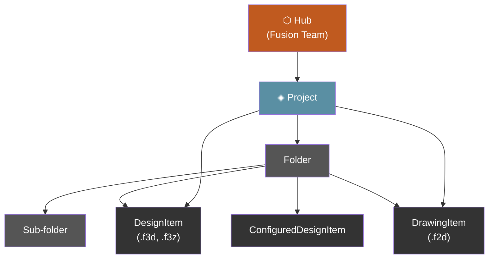
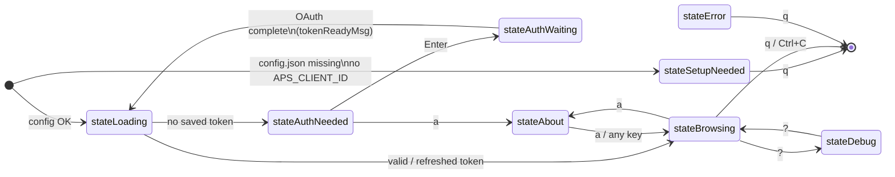
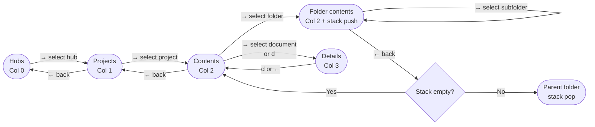
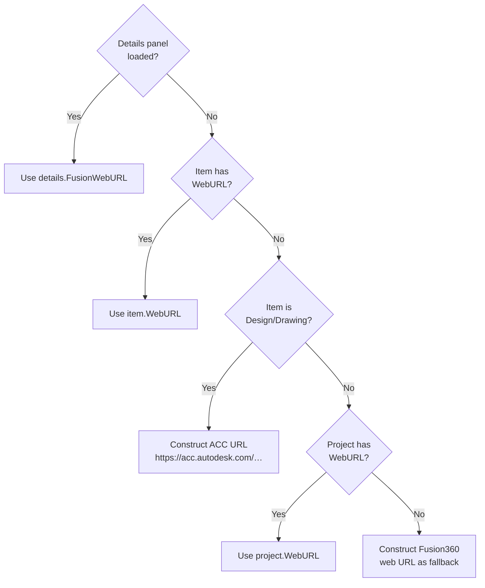
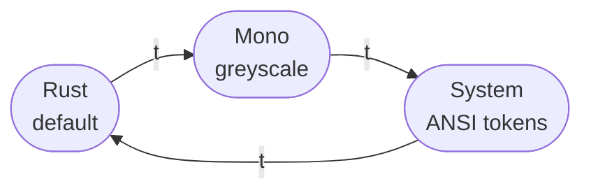

# Navigation & User Interface

FusionDataCLI presents the APS Manufacturing Data Model as a three-column ranger-style browser directly in your terminal. Each column represents one level of the hierarchy. Drilling right loads the next level; pressing left goes back.

---

## Data Hierarchy

The APS Manufacturing Data Model is a tree. FusionDataCLI maps each level to a column in the browser.



**Item types returned by the API:**

| `__typename` | Kind | Container | Description |
|---|---|---|---|
| (hub) | `hub` | ✓ | Top-level Fusion Team |
| (project) | `project` | ✓ | ACC / Fusion project |
| (folder) | `folder` | ✓ | Directory in project |
| `DesignItem` | `design` | — | Parametric design (.f3d) |
| `DrawingItem` | `drawing` | — | 2D drawing (.f2d) |
| `ConfiguredDesignItem` | `configured` | — | Configured design variant |
| other | `unknown` | — | Unsupported type |

---

## Application State Machine



### State descriptions

| State | Description |
|-------|-------------|
| `stateSetupNeeded` | No client ID found in env, config file, or build default. Displays setup instructions. |
| `stateLoading` | Checking saved tokens, refreshing if expired, loading initial hubs list. Spinner shown. |
| `stateAuthNeeded` | No valid token. Prompts user to press Enter to open browser login. |
| `stateAuthWaiting` | Browser opened, local callback server running, waiting for OAuth redirect. |
| `stateBrowsing` | Normal three-column (or four-column with details) interactive browser. |
| `stateAbout` | Scrollable overlay showing version, copyright, MIT license, and third-party credits. |
| `stateDebug` | Scrollable overlay showing raw API request/response log (requires `APSNAV_DEBUG=1`). |
| `stateError` | Fatal error with full message. Quit only. |

---

## Key Bindings

### Navigation

| Key | Action |
|-----|--------|
| `↑` `k` | Move cursor up in active column |
| `↓` `j` | Move cursor down in active column |
| `→` `l` `Enter` | Move focus right — load next level or open details |
| `←` `h` | Move focus left — go back or pop folder from stack |

### Actions

| Key | Action |
|-----|--------|
| `d` | Toggle details panel (fourth column) |
| `o` | Open focused item in system default browser |
| `f` | Open focused item in Fusion desktop (`fusion360://` deep link) |
| `r` | Refresh current column |
| `t` | Cycle color theme (Rust → Mono → System → Rust) |
| `a` | Open About / License screen |
| `?` | Open debug log overlay |
| `q` `Ctrl+C` | Quit |

---

## Screen Layout

### Three-column mode (default)

```
┌──────────────────────────────────────────────────────────────────────────┐
│ FusionDataCLI                                  Loading projects…          │
├─────────────────┬──────────────────────┬───────────────────────────────  │
│ Hubs            │ Projects             │ Contents                         │
│ ──────────────  │ ──────────────────   │ ──────────────────────────────   │
│ > ⬡ My Team    │ > ◈ Alpha            │ > ▸ Designs/                     │
│   ⬡ Partner    │   ◈ Beta             │   ▸ Archive/                     │
│                 │   ◈ Gamma            │     Assembly v2.f3d              │
│                 │   ↓ more             │     Housing.f3d                  │
│                 │                      │     ↓ more                       │
├─────────────────┴──────────────────────┴───────────────────────────────  │
│ [↑↓/jk] move  [←→/hl] navigate  [o] open  [f] Fusion  [r] refresh …    │
└──────────────────────────────────────────────────────────────────────────┘
```

### Four-column mode (details open with `d`)

```
┌────────────────────────────────────────────────────┬─────────────────────┐
│ Hubs        │ Projects      │ Contents             │ Details             │
│ ──────────  │ ───────────── │ ───────────────────  │ ──────────────────  │
│ ⬡ My Team  │ ◈ Alpha       │ > Assembly v2.f3d    │ Assembly v2         │
│             │               │   Housing.f3d        │                     │
│             │               │                      │ Size      24.3 MB   │
│             │               │                      │ Version   v7        │
│             │               │                      │ Type      Design    │
│             │               │                      │                     │
│             │               │                      │ Created             │
│             │               │                      │  Mar 15 2026        │
│             │               │                      │  Alice Smith        │
│             │               │                      │                     │
│             │               │                      │ Modified            │
│             │               │                      │  Mar 28 2026        │
│             │               │                      │  Bob Jones          │
│             │               │                      │                     │
│             │               │                      │ Component           │
│             │               │                      │ Part No.  MFG-001   │
│             │               │                      │ Desc      Main asm  │
│             │               │                      │ Material  Aluminum  │
│             │               │                      │ ★ Milestone         │
│             │               │                      │                     │
│             │               │                      │ Versions            │
│             │               │                      │  v7  Mar 28 2026    │
│             │               │                      │      Bob Jones      │
│             │               │                      │  v6  Mar 20 2026    │
│             │               │                      │      Alice Smith    │
└────────────────────────────────────────────────────┴─────────────────────┘
```

**Width allocation:**
- Details open: details panel = `(terminalWidth × 2) / 5`, nav columns split the remaining `3/5`
- Details closed: nav columns split the full terminal width equally
- Minimum column height: 3 rows

---

## Column Navigation Flow



---

## Folder Stack

Folder navigation uses an in-memory stack to allow arbitrary depth traversal:

```mermaid
sequenceDiagram
    participant User
    participant Model
    participant API

    User->>Model: → (navigate right on Folder A)
    Model->>Model: push "folderA-id" onto folderStack
    Model->>API: GetItems(hubID, "folderA-id")
    API-->>Model: items for Folder A

    User->>Model: → (navigate right on Sub-folder B)
    Model->>Model: push "subfolderB-id" onto folderStack
    Model->>API: GetItems(hubID, "subfolderB-id")
    API-->>Model: items for Sub-folder B

    User->>Model: ← (go back)
    Model->>Model: pop "subfolderB-id"; top = "folderA-id"
    Model->>API: GetItems(hubID, "folderA-id")
    API-->>Model: items for Folder A

    User->>Model: ← (go back)
    Model->>Model: pop "folderA-id"; stack empty
    Model->>API: GetFolders + GetProjectItems (project root)
    API-->>Model: project root contents
```

---

## Browser Open Logic

When `o` is pressed, the URL is resolved in priority order:



---

## Fusion Desktop Deep Link

The `f` key builds a `fusion360://` URI:

```
fusion360://lineageUrn=<itemID>&hubUrl=<processedHubURL>&documentName=<itemName>
```

Hub URL processing:
1. Remove all spaces
2. Strip trailing path components (slashes and suffix chars)
3. Uppercase the result

The URI is then opened with the OS-native handler (`open` / `xdg-open` / `rundll32`), which hands off to the Fusion desktop application if installed.

---

## Color Themes

Three themes are available, cycled with `t`:



| Element | Rust | Mono | System (ANSI) |
|---------|------|------|---------------|
| Accent / highlights | `#C05A1F` orange | `#CCCCCC` light grey | `6` cyan |
| Borders / inactive | `#555555` steel | `#444444` dark grey | `5` purple |
| Dim / muted | `#888888` grey | `#777777` grey | `5` purple |
| Foreground | `#FFFFFF` white | `#FFFFFF` white | `7` white |
| Errors | `#FF5555` red | `#FF5555` red | `1` red |
| Details key labels | `#888888` grey | `#999999` grey | `6` cyan |
| Loading / empty | `#888888` grey | `#777777` grey | `3` yellow |
| Container items | `#89B4D4` blue | `#EEEEEE` light | `2` green |
| Document items | `#FFFFFF` white | `#AAAAAA` dim | `7` white |

The System theme uses ANSI color token numbers rather than hex values, so it inherits and respects your terminal's color scheme (e.g. Solarized, Catppuccin, Nord).

---

## Details Panel

The details panel opens alongside the browser columns when `d` is pressed on any document item (design, drawing, or configured design). It auto-reloads as the cursor moves through documents.

**Fields shown:**

| Section | Fields |
|---------|--------|
| Header | Item name |
| File | Size (human-readable), Version number, MIME type, Extension type |
| Created | Date (Jan 02 2006 format), User full name |
| Modified | Date, User full name |
| Component (designs only) | Part number, Description, Material, Milestone flag |
| Versions | Up to 10 most recent versions — version number, date, author, save comment |

Version history is displayed newest-first. The `itemVersions` query returns them oldest-first; the UI reverses the slice.
